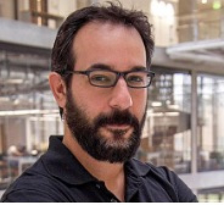
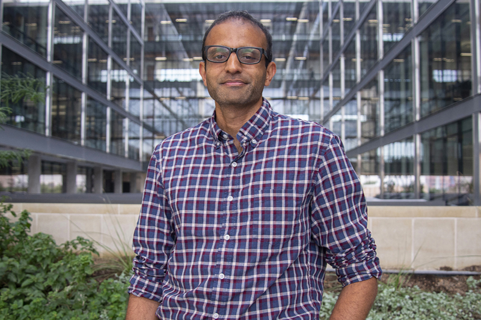
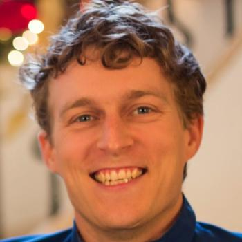
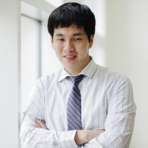

# Prospectives on Generative AI
## A workshop hosted by IFML

Nov 29-Dec 1, 2023 at the University of Texas, Austin 

---

### Scheduled Speakers & Panelists: 

| Image | Instructor | Affiliation |
| --- | --- | --- |
|  | [Adam Klivans](https://www.cs.utexas.edu/people/faculty-researchers/adam-klivans) (Director) | Department of Computer Science, Machine Learning Lab, University of Texas, Austin |
|  | [Alex Dimakis](https://users.ece.utexas.edu/~dimakis/) (IFML Co-Director) | Department of Electrical and Computer Engineering, University of Texas at Austin |
|  | [Sujay Sanghavi](https://www.ece.utexas.edu/people/faculty/sujay-sanghavi) | Department of Electrical and Computer Engineering, University of Texas, Austin |
|  | [Jon Tamir](https://users.ece.utexas.edu/~jtamir/) | Department of Electrical and Computer Engineering, University of Texas, Austin |
|  | [Surbhi Goel](https://www.surbhigoel.com/) | Computer and Information Science, University of Pennsylvania |
|  | [Zico Kolter](https://zicokolter.com/) | Department of Computer Science, Carnegie Mellon University |
|  | [John Duchi](https://profiles.stanford.edu/john-duchi?releaseVersion=9.9.1) | Statistics & Electrical Engineering, Stanford University |
|  | [Mathews Jacob](https://engineering.uiowa.edu/people/mathews-jacob) | Department of Electrical and Computer Engineering, University of Iowa |
|  | [Zaid Harchaoui](https://faculty.washington.edu/zaid/) | Department of Statistics, Allen School in Computer Science & Engineering, University of Washington |
|  | [Daniel Hsu](https://www.cs.columbia.edu/~djhsu/) | Department of Computer Science, Columbia University |
|  | [Dylan Foster](https://dylanfoster.net/) | Reinforcement Learning Group, Microsoft Research |
|  | [Aditi Raghunathan](https://www.cs.cmu.edu/~aditirag/) | Department of Computer Science, Carnegie Mellon University |
|  | [Georgia Gkioxari](https://gkioxari.github.io/) | Computing and Mathematical Sciences, Caltech |
|  | [Jon Barron](https://jonbarron.info/) | Senior Staff Research Scientist, Google Research |
|  | [Sitan Chen](https://sitanchen.com/) | John A. Paulson School of Engineering and Applied Sciences, Harvard University |

